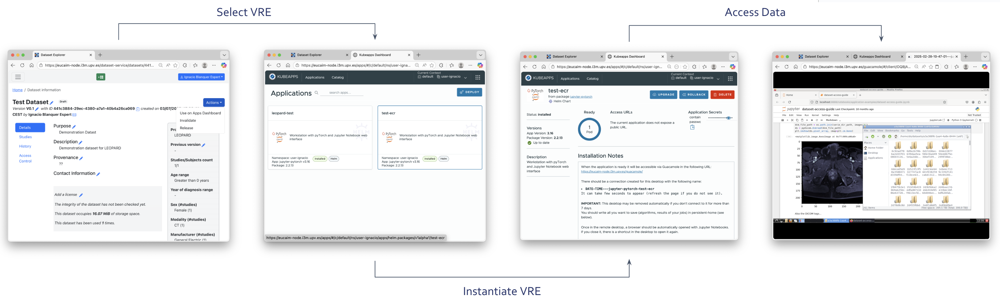

# 3. Components of the platform
This section briefly describes the components of the platform, updating the descriptions provided in deliverables D5.1 Early release of the Data Federation Framework and D4.3: First rules for participation report. These deliverables are not extensive descriptions of the architecture. This is kept continuously updated in an online document [Architecture of EUCAIM](https://eucaim.gitbook.io/architecture-of-eucaim/).

## 3.1. The Dashboard
The Dashboard is the entrypoint to the platform and contains the general information about the statistics, the available datasets and the links to the different services of EUCAIM’s architecture. The Dashboard includes the main information and the links to the different services and applications. A detailed description of the functionality of the Dashboard is provided in Deliverable D4.8 Final EUCAIM Dashboard.

## 3.2. The Catalogue
The catalogue contains the metadata of the datasets within EUCAIM. Through the filtering of and the browsing through the public catalogue entries, a user can freely look for datasets that are relevant to their research. Only after they have found a suitable dataset, a request can be made to access the actual data through the Negotiator.

## 3.3. The AAI
Some services in EUCAIM allow anonymous access (Dashboard and the Catalogue). Those services provide access to general information, onboarding processes and aggregated data. Finer-grain searching and data access require authentication and authorisation.

Authentication and Authorisation in EUCAIM relies on the [Life Sciences AAI](https://lifescience-ri.eu/ls-login.html). LS AAI is the commonly agreed AAI framework for Life Sciences Research Infrastructures. It relies on the [AARC blueprint](https://aarc-community.org/architecture/) and supports the EDUGain Federation (which serves most academic and research organisations in Europe), as well as other public Identity Providers. The process of registering in EUCAIM involves two steps:

Creating an account on the LS-AAI environment. This enables linking your institutional or public credentials to an LS-AAI account so you can use your institutional IdP for authenticating.

Enrolling in the EUCAIM VO Group. Federated search and negotiator services of the EUCAIM platform are available only to the members of the EUCAIM VO group.

The instructions for the sign up and enrollment of users are described in Annex I of this document.

## 3.4. The Federated Search
Federated search enables users to retrieve the number of subjects that fulfil a specific criteria. The federated search provides a user interface that interacts with a broker that distributes the query to the different providers registered. The federated search results are linked to the catalogue through hyperlinks. Figure 3-1 shows a schema of the interaction among the three above components.

The Federated Search cores services sends the queries to the registered data holders and retrieve the aggregated results from them. The results are shown in the federated search GUI which links the results to the additional information on the datasets available in the catalogue.
The federated search will incorporate progressively more providers and datasets, as well as more searching criteria.

## 3.5. The Access Request
Access request is initiated from the catalogue and it is managed by the negotiator component. Information about the datasets that a user would like to access is transferred from the catalogue to the negotiator tool, where the data requester can submit an application, which is processed by the EUCAIM manager and the dataset responsible, on behalf of the access committee who is the body that effectively performs the evaluation of the application. Information is exchanged through the negotiator communication system, including the access link to the dataset. Figure 3-2 shows the interactions among the components.

Access request starts from the catalogue, which triggers the connection to the negotiator passing all the information needed through. Interactions between the dataset responsible (on behalf of the Access Committee) and the data requester are performed through the negotiator, ending up with the transfer of the access link to the dataset in the data holder.

## 3.6. Access to data
EUCAIM provides secure environments where the data can be processed and a federated processing service. Some nodes provide a secure and user friendly environment with GUIs where users can explore and process the data (CHAIMELEON, EUCAIM UPV, XXXX). Federated processing allosw to send processing jobs to the nodes without directly accessing to them.

### 3.6.1. Accessing to data in a secure environment
The nodes with processing environments are mainly intended for Data Scientists and supports in-situ processing of the data. Each node may have different access features and conditions, and precise information will be given in the access request.

Previous figure shows the process of accessing data in one of the Secure Environments, which consist on selecting the dataset from the User's Library, choosing the rightmost Virtual Research Environment from a catalogue, instantaiating it and acccessing the data through a remote desktop.

### 3.6.2. Accessing to data through the Federated Processing
TO-DO

## 3.7. Other services for Software Developers and Data Holders
The Plataform offers other services to Software developers to register and upload their binaries and additional documentation, as well to create persistent identifiers of the Datasets, the services are:
- A service with the Hyperontology ([https://hyperontology.eucaim.cancerimage.eu/]), which has the linked data information from all the terms in the EUCAIM Hyperontology
- A PID resolver service ([https://pid.eucaim.cancerimage.eu/dataset-id]), that forwards to the Catalogue entry of a dataset by providing its UUID. This provides uniquely resolvable identifiers to the datasets information similar to a DOI.
- A document server ([https://drive.eucaim.cancerimage.eu/]), where users can find the applications and documents and Software Developers can upload their binaries and additional documents. 
- An OCI registry ([https://harbor.eucaim.cancerimage.eu/]) to store and download containerised applications.

