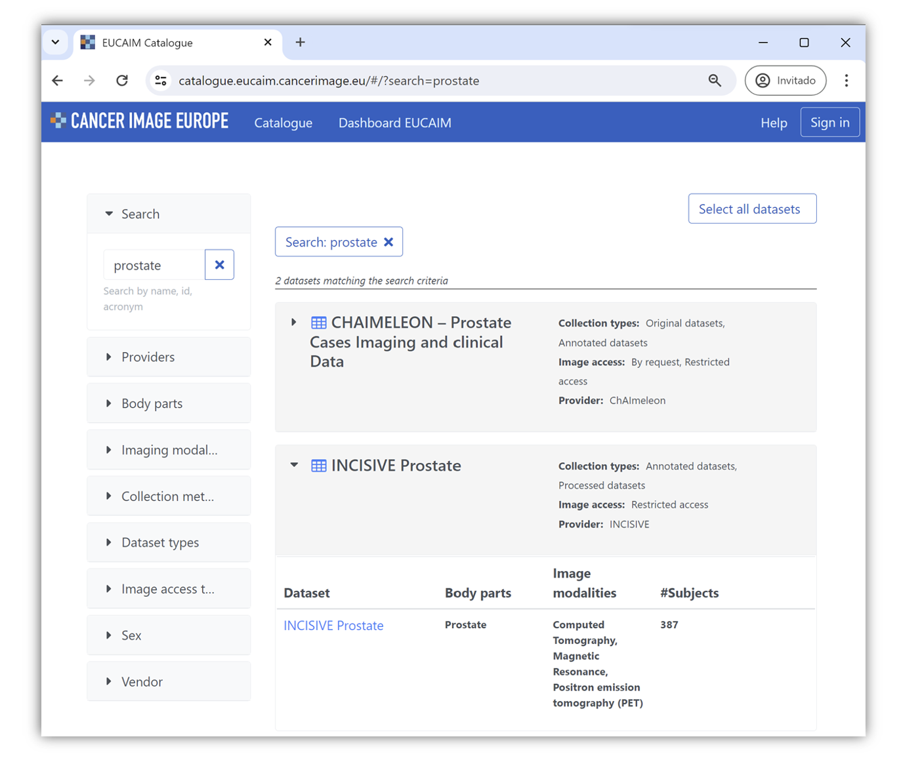

# 4. User guide for Researchers
This guide is designed to help researchers navigate the platform, access data, and understand the procedures in place. The EUCAIM platform facilitates data sharing, reuse, and collaborative research within a governed framework to ensure transparency and compliance.

## 4.1. Platform access
The access to the platform is managed through the dashboard component, exposed in the https://dashboard.eucaim.cancerimage.eu/ URL, which can be opened in a browser on your computer or mobile device (tablet or smartphone). You can also access the dashboard through the EUCAIM project main website by clicking on “Visit the new dashboard preview!” available at https://cancerimage.eu/. Figure 4 shows a snapshot of the dashboard landing page and the cancerimage.eu main page.

Figure 4-1. EUCAIM Dashboard, anonymous access (left) and EUCAIM project main webpage (right).

## 4.2. Anonymous Users
### 4.2.1. Collection Summary
As soon as you access the dashboard, you will find some summary diagrams that allow you to monitor the EUCAIM data population in real time. By hovering over each diagram, you can see information about the available datasets and subjects in each one, the number of studies for each imaging modality, and details of the main body parts to which the images correspond. Figure 5 shows a snapshot of those dynamic graphs.

Figure 4-2. EUCAIM Dashboard, collection summary.
### 4.2.2. Roles information
If you continue browsing the dashboard, you will find different ‘Become a’ sections corresponding to the four main roles that can be part of EUCAIM (see figure 6):

Users are researchers or innovators with a clinical scientific or clinical question wishing to develop, train, benchmark or validate AI algorithms.

Software providers are researchers or innovators who want to contribute with image processing tools to the marketplace of solutions of EUCAIM.

Data holders are data providers who would like to contribute with data either through a Data Transfer Agreement, depositing the data in a reference node of EUCAIM or through a Data Sharing Agreement setting up a federated node at the data holder’s premises.

Members are organisations, institutions, or companies interested in collaboration with the EUCAIM consortium which are not yet an official partner. Members will have the opportunity to participate in the observational project calls.

This user guide is centred on the role of the users. Therefore, by choosing the “Become a User icon”, you will obtain detailed information on which data EUCAIM provides, how the data request process is, the rules of participation and how to log in the platform.

Figure 4-3. EUCAIM Dashboard, collection summary.
### 4.2.3. Public Catalogue
As a user of the platform, even before registering, you can browse our Public Catalogue, where you will find information about all the available datasets, without requiring authentication. As shown in figure 7, you have two options to access the Public Catalogue:

Click the “PUBLIC CATALOGUE” button in the top right corner of the header

Select the "Explore Public Catalog" Highlighted link

Figure 4-4. EUCAIM Dashboard, how to explore the public catalogue.
Both options will replace the current page with the Public Catalogue site. You can always return back to the dashboard main page by clicking on "Dashboard EUCAIM" option on the header. Figure 8 shows a snapshot of the catalogue landing page.

Figure 4-5. EUCAIM Public Catalogue, anonymous view
The Public Catalogue offers basic search and filtering options to help you find relevant datasets that align with your research interests and objectives. Filters are available in the panel on the left side of the screen. When applying filters, the datasets meeting your criteria will be displayed, as shown in figure 9,

Figure 9. EUCAIM Public Catalogue, how to perform filters.
By selecting a dataset, clicking on its name, you can view all its relevant information, helping you understand it better. Although you cannot access or visualise the data at this point, thanks to the Public Catalogue, you will be able to see relevant metadata that provides significant information about them. Figure 10 shows a snapshot of the dataset metadata.

Figure 4-7. EUCAIM Public Catalogue, dataset metadata overview.

Figure 4-8. EUCAIM Public Catalogue, datasets overview (left) and data relations (right). The repository has several networks, each network has several imaging biobanks, each imaging biobank can have several datasets, and so on.
This structure allows you to efficiently explore the resources and understand the potential of the platform before committing to the registration process. Research datasets are organised according to the minimal units in which they can be accessed. In some cases, datasets correspond to all the data in a repository related to a specific cancer type. In other cases, datasets correspond to individual data holders, depending on the conditions of the data transfer or data sharing agreements.

Additionally, you will see a special dataset in the catalogue called "Build an Observational Study with RWD." The purpose of this dataset is to provide you with a way to create your own observational study by collecting data that is not yet available in the catalogue through our stakeholders network.

Figure 4-9. EUCAIM Public Catalogue, dataset for building an observational study.
Note that the observational study dataset does not contain information by itself, which will be collected on demand.

### 3.2.4 Other relevant information

Additionally, in the dashboard main page (see figure 13), you can watch our latest platform webinar, held in March 2024, which provides a comprehensive tutorial on how to use the platform and access the components, as well as addresses several interesting questions from participants.

Figure 4-10. EUCAIM Dashboard’s webinar.
It is important to state that EUCAIM is a federation that uses several applications and services from a widespread community. As shown in figure 14, you can explore and learn more about the technologies our platform relies on, by clicking on each logo. These technologies are developed by key collaborations as well as by third parties.

Figure 4-11. EUCAIM Dashboard, anonymous access.
## 4.3. User’s registration
After exploring the Dashboard and the Public Catalogue, you can proceed to the login screen to register, to get access to all the components available at the platform. There are three ways to do so (see figure 15):

Access the “My Profile” area of the Dashboard

Scroll to the bottom of the "Become a User" section and click on the "Become a User now" button.

Figure 4-12. EUCAIM Dashboard, user’s registration through “My Profile” area (top) and from “Become a User” area (bottom).
Annex I. Registration of Users in EUCAIM shows how to create an account in the AAI system in EUCAIM through the EUCAIM Dashboard. It describes in detail the process of creating a Life Science AAI account and the request for membership in the EUCAIM Group.

## 4.4. Accessing the components
As an authenticated user, you can now access all the components available in the platform, from the header of the dashboard (see figure 16).

Figure 4-13. EUCAIM Dashboard, authenticated access.
## 4.5. Searching data
As an authenticated user, a deeper search of the data can be done using the Federated Query component. This component allows for an advanced search across multiple sources.

Figure 4-14. EUCAIM Federated Query
The Federated Query component provides various filters to refine your search (see figure 17). These filters are available at the right panel and include:

Patient information

Gender

Age at diagnosis

Clinical Parameters

Diagnosis

Year of diagnosis

Image Parameters

Modality

Body Part

Manufacturer

As a result, you will obtain the collections with the total amount of studies and subjects fulfilling your search criteria. Additionally, clicking on the name of the dataset, you will be redirected to its entry in the Public Catalogue, where you will be able to request access to it (see figure 18).

Figure 4-15. How to access the EUCAIM Public Catalogue information from the federated query.
So once you have found the datasets that meet your search criteria for your study, you can download a report of the results by clicking on the download button and then return to the Public Catalogue to initiate the data access request. This report contains the details of the query and the results obtained, and it will be used to narrow down the details of the access request. Data is coded into JSON format.

## 4.6. Requesting Access
Now that you have identified the datasets valuable for your project, you can start the negotiation process to request access to them. Here's how:

Return to the Public Catalogue (see figure 19):

Go back to the Public Catalogue and add the selected datasets as shown in the figure, by clicking on the ‘Add’ button.

Review Your Selection (see figure 20):

After selecting all desired datasets, review your selection in the menu located at the top right. You can select as many datasets as desired for your Research project, under the same proposal.

Ensure your selection is accurate and remove any dataset if needed.

Send selection for negotiation:

Once satisfied with your selection, click on the "Send to the negotiator" button to initiate the negotiation process.

Figure 4-16. How to add datasets for requesting access to them.

Figure 4-17. How to start the negotiation process.
After sending your selection to the negotiator, you will be redirected to the Negotiator component webpage, where you can complete your submission by preparing and providing all the required documents and information about your R&D project.

First, a brief summary of your request will be displayed (see Figure 21). By clicking "Next," you can start filling out the mandatory information and uploading the required documents.

Figure 4-18. Negotiator Access Form.
More information about these documents can be found in Annex II. Documentation Required by the negotiator for existing datasets. You can also access this information on the negotiator documentation in the "Become a User" section of the dashboard. Note that for the submission, you need an already approved project with a favourable Ethics Committee report, which justifies the request for accessing the data (see figure 23).

Figure 4-19. How to access the documentation required by the negotiator for existing datasets.
Moreover, bear in mind that if you are seeking to build your own Observational Study with RWD, you can make a proposal by selecting the "Build an Observational Study with RWD" dataset. By sending it to the negotiator, you will be able to fill out the request, including the documents described in Annex III. Documentation Required by the Negotiator for building datasets, regarding your proposal (see figure 24). You can also access this information on the negotiator documentation in the "Become a User" section of the dashboard. We will then share it with our network of clinical data holders to make your project a reality.

Figure 4-20. How to access the Documentation Required by the negotiator for building datasets.
An overview of the Access Form submission is shown before you submit the request. Once submitted, it will undergo an evaluation process. First, the application will undergo an administrative review to ensure all information is valid. Then, it will be reviewed by the Access Committee, which will conduct a technical and scientific evaluation.

Figure 4-21. Negotiator application overview before submitting.
Finally you can review your requests and check your open negotiations, tracking their status and modifications (see Figure 26). The EUCAIM team will respond to your submitted requests as soon as possible, enabling a smooth negotiation process to grant you access to the valuable selected datasets and allowing you to start your project.

Figure 4-22. Overview of a submitted application.
The lifecycle of negotiations is described in figure 27, and comprises the following statuses:

Under Review. The application proposal has been submitted and the eligibility is being evaluated by the Access Committee.

In Progress. The application proposal has been approved and the availability of data and access conditions are being collected. The positive progressing sub-statuses that the application goes through are:

Representative Contacted: The dataset representative has received the request.

Checking availability: The dataset representative is checking that the data request matches the data available in the dataset.

Resource Available: An intermediate step to inform the data requester that the data holder has the data requested before the access conditions are communicated back.

Access conditions indicated: The dataset responsible provides the access conditions for the specific use case of the data requester. General access conditions are provided before the negotiation starts, but depending on the purpose the data holder may require additional guarantees.

Access conditions met: This sub-status is triggered by the data requester when the access conditions are received and are acceptable by the user.

Resource Made Available: This sub-status is the final one of the “In-progress” status and indicates that the access to the data has been granted. The dataset representative will send the access procedure and will ensure that the user account in LS-AAI is valid for accessing the data. This is an intermediate status triggered by the dataset responsible.

Started: This status indicates that the application submission has been successfully evaluated and access to the data is granted.

Concluded: This status indicates that the project that supported the access to the data has been completed and access to data is not anymore available.

Abandoned or declined: Both statuses lead to the termination of the data access request application process. Abandoned status is triggered by the user and Declined status is triggered by the EUCAIM side.

Figure 4-23. Application workflow.
Additionally, there are three sub-statuses of the “In progress” status that holds or terminates the process due to different conditions:

Resource unavailable, when the data requested does not match the data available. For example, the data request may include clinical information that is not available.

Resource unavailable but willing to collect, when the dataset responsible considers that the request can be addressed but it will require additional actions (e.g. additional processing resources, software packages) or data that can be obtained in an observational study.

Resource not made available, triggered by the data requester when the access conditions for the data cannot be accepted.

The information exchange among the different actors for each one of the stages is shown in detail in the negotiation application and through e-mail. Figure 28 shows a snapshot of the user requester and admin panels.

Figure 4-24. Overview of all submitted applications from a user (left) and control panel from the dataset responsible person.
## 4.7. Accessing Data
Data can be accessed under different conditions, depending on the licence and traceability requirements of the data. In this context, EUCAIM differentiates among three models:

Datasets can be downloaded for off-line processing. This is only possible for datasets with low traceability restrictions, as EUCAIM cannot trace the data beyond the boundaries of the platform.

Datasets that cannot be downloaded but data can be visualised and processed using on-site Virtual Research Environments. Users will access the data remotely and major interactions (data visualisation, access, processing and release) are monitored by the EUCAIM platform.

Data that cannot be visualised and can only be processed remotely through batch jobs. In this case EUCAIM will provide an interface to run processing jobs on the data available in the providers of the federation. In this case, EUCAIM will register all the interactions with data.

This guide covers mainly the first two cases, as the federated processing will be ready later in the project.

The access to the data is performed through the nodes of the federation. Two reference nodes have been set up to store data from the centres who cannot implement a federated node and area allowed to transfer the data to the reference nodes, as well as to provide computing resources. Each reference node is based on a different technology to maximise flexibility. This document contains two subsections, each one for a different reference node.

## 4.8. Reference Node at UPV
The UPV reference node is based on an evolution of a technology developed in the CHAIMELEON (https://chaimeleon.eu/) project. This technology has been enhanced in three directions:

To provide multi-tenant support, allowing multiple projects and a finer granularity of the access permissions through Access Control Lists.

Integrated with a totally renewed image workstation software from QUIBIM (QP-Insights).

Supporting the federated core services of EUCAIM (LS-AAI, FAIR Data points, federated search mediator and a materialisation component for distributed processing.

The UPV reference node is mainly intended for Data Scientists and supports both in-situ and federated processing.

The entry point to the UPV reference node is the local catalogue. The local catalogue describes the datasets stored in the reference node and feeds the EUCAIM platform repository. Figure 29 shows the view of this catalogue with the information of one of the subprojects of CHAIMELEON.

Figure 4-25: Reference UPV node, view of the CHAIMELEON OpenChallenge project.
The aggregated information is publicly available and it is stored in Zenodo too. Figure 30 shows a snapshot of the details page of one of the datasets, accessed by clicking on the “More” link.

Figure 4-26: Reference UPV node, view of the aggregated data from the reference node catalogue (left) and Zenodo (right).
The access to the dataset requires valid credentials. Users that have received a positive evaluation of the data access request will have access granted through her LS-AAI account. Once logged in (see figure 31), the user will see more information on the dataset and will be able to use the data on the Application Dashboard.

Figure 4-27: Reference UPV node, view of the aggregated data from the reference node catalogue (left) and Zenodo (right).
The user can deploy a Virtual Research Environment (VRE) through the App Dashboard. Four environments are provided with two different AI frameworks (Pytorch and Tensorflow) each one with or without a Jupyter notebook server (see figure 32). Users can find a previously deployed VRE environment or deploy a new one.

Figure 4-28: Catalogue of VRE applications (left) and applications deployed by the user (right).
The deployment of a VRE from the catalogue provides the user the way to visualise and process the data. The deployment of a VRE through the catalogue only requires providing a valid name for the environment (only lower letters, a hyphen and numbers). The access to the VRE is performed through a reverse proxy in the platform. Figure 33 shows both actions.

Figure 4-29: Deploying a VRE (left) and accessing the VRE link through the Reverse proxy (right).
Access to the data is performed through the GUI of the VRE. The VREs are based on Ubuntu 22.04 LTS workstations with LXDE as GUI. This environment is provided with tools, services and software libraries, as well as batch queues for non-interactive jobs. Detailed information on the usage of the job queues is provided in the platform documentation[3]. Figure 34 shows a snapshot of an instance of a VRE environment with access to the prostate data. This is accessed through a web browser, minimising the requirements of the user.

Figure 4-30: GUI of the UPV reference node, showing a Jupyter notebook and a fileserver window.
The user is provided with three directories:

Persistent home, restricted to the user, and where the user can store the data that she would like to preserve.

Dataset, read-only folder with the information on the datasets, stored following the hierarchical model of the data shown in the green bubbles of figure 11.

Persistent-shared-folder

Any other folder is considered as volatile and data stored on it will disappear once the job has finished or the VRE is deleted. Data stored in the persistent home directory will remain available across the lifetime of the applications.

## 4.9. Reference Node at the Euro-BioImaging Medical Imaging Repository
The Euro-BioImaging Medical Imaging Repository (a reference node in EUCAIM) focussed on storing data for Data Holders. The Euro-BioImaging Medical Imaging Repository service is an XNAT instance operated by Health-RI. To access the data that is on the Euro-BioImaging Medical Imaging Repository, the first step that you should do is to request an account for the Euro-BioImaging XNAT (https://xnat.bmia.nl). This can be done at the EUCAIM Helpdesk (Section 3.9) who will forward the request to the Health-RI helpdesk at https://trait.topdesk.net/. You will receive an email asking to agree with the Health-RI data access policy and will receive your credentials. The Euro-BioImaging XNAT is currently in the process of implementing single sign-on which will allow using the same credentials as the ones used in EUCAIM in the future.

Before the access is granted, the responsible person of the dataset has to update the profile in the XNAT to give access to the specific dataset. They can also contact the Health-RI helpdesk for further assistance.

You will need to be logged in to the Euro-BioImaging XNAT to access most image datasets. If you are not logged in or do not have access granted to your account, figure 35 shows it up, indicating there is no access to the project data:

Figure 4-31: Access denial.
Logging in can be done at the homepage, or by clicking “Login” at the top-right corner of the screen. Use your Euro-BioImaging XNAT credentials to log in (see figure 36).

Figure 4-32: Logging the platform.
Once logged in, you can access the project data. The top grey box displays generic information about the project, like the description and investigators working on it. The bottom table shows a list of subjects, with each row containing information about the data contained in them. This information can be different for each dataset, but generally includes the number of imaging sessions per modality. (figure 36)

Figure 4-33: Information per dataset.
Clicking on the subject ID reveals a screen with additional information on the subject. For example, it shows the date the subject was added to the Euro-BioImaging XNAT data repository, as well as all imaging sessions (called “Experiments”), modalities and their dates associated with the subject (see figure 38).

Figure 4-34: Detailed information of a subject.
By clicking on an experiment, more information will show up, like the time and date of acquisition and a summary of the DICOM headers. Depending on the degree of anonymization, the gender and age of the subject could also be shown.

Figure 4-35: Detailed information of a study.
From here, there are many things you can do. The “Download” button gives you access to raw DICOM files, if present. You will be asked to select the series you would like to download, after which you can click “Download”. The images will first be combined on the server into a zip file before being downloaded onto your local hard drive.

Figure 4-36: Downloading data from the platform.
XNAT also has a built-in DICOM viewer, i.e. the OHIF viewer by the Open Health Imaging Foundation[4]. Note: this viewer is not certified for clinical use and is meant for investigational and research purposes only. The viewer can be accessed by clicking “View Images” on the right-hand side. The first time an image is viewed by anyone, the viewer will need to do some preparing. This can take some time (multiple minutes) and it may seem like nothing is happening. After these minutes, the image will show up.

By default, holding the left mouse button can be used to adjust the window width and level. The scroll wheel can be used to scroll through slices, holding the right mouse button is for zooming in/out. At the menu bar you can select multiple controls, for example to change the left mouse button to “stack scroll” instead of “window” akin to a radiological PACS. In the left column, multiple series are shown of the same experiment (if available).

Figure 4-37: visualisation of images in the EuroBioImaging reference node.
## 4.10. Helpdesk
The EUCAIM helpdesk is a single point of contact to collect and reply to questions, incidents, requests, etc. The software responsible for the EUCAIM helpdesk is Zammad and an independent instance has been provided for the project.

Currently, only authenticated/authorised users can access the helpdesk system. Therefore, it is necessary to authenticate yourself at the system so you can be authorised to use the helpdesk.

This is done through LS AAI (Authentication and Authorization system), clicking at this link: https://help.cancerimage.eu/#login.

The first page that appears is this:

Figure 4-38: Helpdesk access page.
You have to click at the “Connect to LS AAI” in order to authenticate yourself. That will lead you towards the page where you should choose the company/institute/account you are linked to.

This is a “new” Authentication/Authorization technology where it is not necessary anymore to have your personal/individual certificate, instead of this, the institute you work with or your account in several providers, will identify yourself into the system with an individual token.

The process of logging in is quite similar to the rest of the EUCAIM core services. If you do not have a valid account you should check it with your account provider, registration is described in Annex I.

You have to choose the institute you are related with or an account at several service providers, as shown in this page. There is also an option for “LifeScienceHostel”.

After choosing the institute or account you will be taken to the proper authentication place where you can provide your username and password. Of course, only valid credentials at institutes and accounts will be accepted.

Once you are authenticated, the next times you access the system, you will have your institute shown at the page shown above. You still can use another institute/account if you want. When entering your institute name you can search for it using a partial entry for its name. Before going ahead, you should read the AUP (Acceptable Policy Usage) document, which can be found at the link in your screen as Privacy policy for the service EUCAIM Helpdesk , as described in figure 43.

Figure 4.39: Privacy policy for the Helpdesk.
You will be prompted to see and confirm your information, sent from your institute to the EUCAIM Helpdesk. If the data displayed is your data and is correct, you can click at the end of the page “YES, Continue”, which will lead you to the EUCAIM Helpdesk system. You can also “cancel” this access operation. After confirming, you will be at the EUCAIM Helpdesk instance provided by Zammad.

You can create/add a new ticket to the system by clicking at the green “plus” button, at the left bottom of the page, where you will be prompted to fill in the content for each corresponding field. Ticket fields (see figure 44) with an asterisk (“*”) are mandatory. To conclude the creation of a new ticket you should click at the create button.

Figure 4-40: Form for the creation of a ticket.
Every ticket has an unique identification number, displayed on the top left of the ticket. You can also use the URL for this ticket.

Every new ticket is assigned to the First Level Support Unit Team. This EUCAIM First Line SU is a group of people who may:

reply to you requesting for more information or,

Solve this ticket, replying with the solution for the ticket or,

Assign your ticket to another Support Unit. Each assigned SU has specialised people on the matter your ticket is related to. They will reply to you in the ticket.

For every reply you have in each ticket you will get an email from the EUCAIM Helpdesk system, informing you of all new activities related to each ticket. In order to leave the system, click in your initials icon, at the bottom left corner and in the “Sign out” button.

For more information about EUCAIM Helpdesk, please refer to the EUCAIM Helpdesk End-User Guidelines at https://confluence.egi.eu/display/EUCAIM/EUCAIM+Helpdesk+End-User+Guide/display/EUCAIM/EUCAIM+-+Helpdesk
