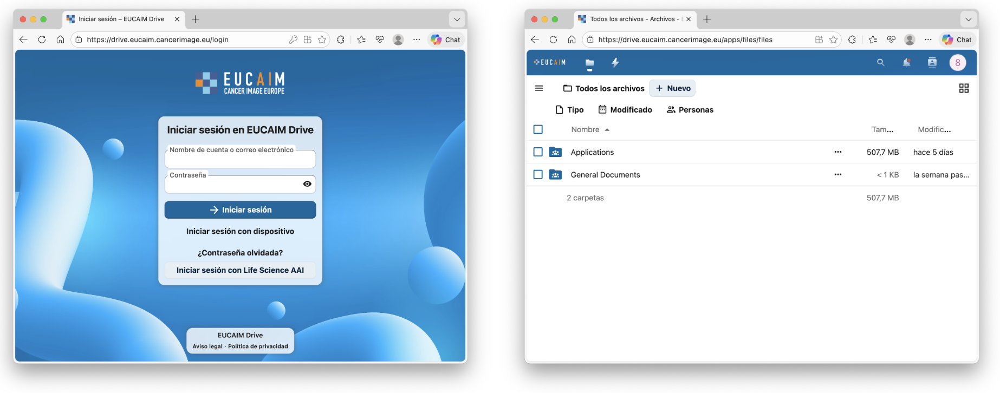
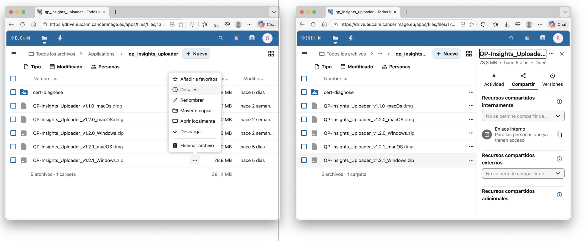

# 5\. User guide for Software providers
## 5.1. Enrolment
This guide is designed to help Software providers navigate the platform and understand the procedures in place. If you keep browsing the dashboard, you will find different ‘Become a’ sections corresponding to the four main roles that can be part of EUCAIM.

By choosing the Become a Software Provider icon, you will obtain detailed information about EUCAIM software specifications and the rules of participation.

Finally, at the end of the page, you will have the opportunity to start the process of becoming a Software provider by fulfilling the Expression of Interest for new Stakeholders.

Once you have expressed the interest to become a software provider, you will be invited to submit an application that will be reviewed by the access committee. Additional information about the requirements of applications running in the EUCAIM platform can be found in https://github.com/chaimeleon-eu/workstation-images. The Technical Team will contact you, by means of the Helpdesk, to assist you in the preparation and validation of your tools.

# 5.2. Software Integration
The normal procedure to integrate an application is creating a Docker image containing the main binary or script file and all the dependencies/libraries required to execute it. But there are some conditions that the image must be considered concerning security and data access. Detailed instructions on software packaging are provided in the [Software Packaging Guide](https://drive.google.com/file/d/1BIwfPVU4rWKRjye-r86304XGa9acztVk/view?usp=sharing).

Those instructions do not apply to applications that are expected to be downloaded by the data holders to prepare the data, and refer only to those applications to run inside the EUCAIM platform.

## 5.4. EUCAIM Software registry
EUCAIM provides a software registry for those applications that has to be updated to work in the context of EUCAIM. The software registry is based on a Harbor registry of artifacts, and it is deployed in [https://harbor.eucaim.cancerimage.eu](https://harbor.eucaim.cancerimage.eu). The registry can store OCI-compatible software containers, helm charts and other artifacts. Non-OCI compliant artifacts can be encoded through a tool such as ORAS ([https://oras.land/](https://oras.land/)) or (preferrably) can be uploaded to EUCAIM's dedicated drive (see next subsection).

The EUCAIM Software Registry is restricted to users in the Harbor subgroup of the EUCAIM VO ([https://perun.aai.lifescience-ri.eu/organizations/3345/groups/43153](https://perun.aai.lifescience-ri.eu/organizations/3345/groups/43153)). Enrolment to this subgroup can be requested on the first access to the registry. A valid LS-AAI account is needed.  Next figure shows the page that will be shown at the first access time and the form to be filled in to request access to the subgroup.

Data holders can grant access to pull software artifacts once they register in the platform through the specific section in the Dashboard (see section 6). Only Software developers can push SW artifacts in the repository, which have to be validated by the technical committee. Software developers register through the form indicated at the beginning of this section.

Two subrepositories (projects in the harbor jargon) are available:
- ingestion-tools, for tools developed to prepare or upload the data by the data holders. These tools would be downloadable and could be used by the Data Holders in their own premises, once they have access granted.
- processing-tools, for tools developed to process the data. The tools in processing-tool project will be mainly used in the processing environment. Tools cannot be downloaded outside of the Processing environment boundaries.

The procedure for pulling or pushing an OCI-compliant artifact (e.g. a Docker container) is the following:
- Retrieve the user and access token through the harbor registry user profile (see figure 5.1)
- Open a terminal on a computer with Docker installed (version 25 or higher). 
- Login through `docker login harbor.eucaim.cancerimage.eu -u <<user>> -p <<token>>`, replacing <<user>> and <<token>> by the values obtained in the user's profile.
- Push an image using the standard Docker command: `docker push harbor.eucaim.cancerimage.eu/<<project>>/<<image_name>>:<<tag>>`, replacing `<<project>>` by one of the two projects available: ingestion-tools if the tool is related to data preparation and uploading or eucaim in case of a processing tool. Replace `<<image_name>>` and `<<tag>>` by the appropriate values.
- Pull an image using the Docker command: `docker pull harbor.eucaim.cancerimage.eu/<<project>>/<<image_name>>:<<tag>>`. Replace the values into curly brackets by the appropriate values.

In the case that you want to upload a binary file that cannot be (or shouldn't be) containerised (such as Windows/MacOs native tool for data preparation with its own Graphical User Interface), binaries can be embedded in an OCI package or (preferrably) upload it to the drive repository of EUCAIM (see next subsection). The next steps describe how to convert a binary into an OCI package and upload it in the harbor repository. Additionally, you instructions to download it and unpack the binaries is provided.
In this case, we suggest to provide the `docker pull harbor.eucaim.cancerimage.eu/<<project>>/<<image_name>>:<<tag>>` as the download link.
- The procedure for pulling or pushing non OCI-compliant artifacts (e.g. a zip file) is the following:
- Retrieve the user and access token through the harbor registry user profile (see figure 5.1)
- Install ORAS tool ([https://oras.land/docs/installation](https://oras.land/docs/installation)).
- Login in the registry using the command `oras login harbor.eucaim.cancerimage.eu`, and provide a username and a token (see figure 5.1).
- Push an artifact (e.g. a zip file) with the command `oras push harbor.eucaim.cancerimage.eu/<<project>>/<<artifact-name>>:<<tag>> --artifact-type application/zip ./myfile.zip` . The artifact-type option is a descriptive string. Replace <<project>>>, <<artifact-name>> and <<tag>> as described in the previous case.
- Pull an artifact with the command: `oras pull harbor.eucaim.cancerimage.eu/<<project>>/<<artifact-name>>:<<tag>>`

In this case, we suggest to provide the `oras pull harbor.eucaim.cancerimage.eu/<<project>>/<<artifact-name>>:<<tag>>` as the download link.

## 5.5. EUCAIM Drive
A repository has been deployed to upload and download other type of objects, such as non-containerised applications or documents. The repository is available in the URL [https://drive.eucaim.cancerimage.eu/](https://drive.eucaim.cancerimage.eu/) and it has two main areas:

- General Documents: An area where the general documents of the project are stored and linked. This area is restricted to admin users for uploading and public links to those documents are available in the Document section of the Dashboard.
- Applications: An area where the documentation and the binaries of the applications can be uploaded and downloaded.

Only users in the "pull" or "push" subgroups of the harbor group in EUCAM LS-AAI VO can access the documents through the interface. Users in the "push" subgroup can create folders and store documents in the Application area. Software develepores who want to upload binaries and documents for their tools should creatre a folder with the tool name and store the data there, creating public links to make the objects accessible.

To create a symbolic public link, a user with write permissions can click on "Details" and copy the public URL created by the system. Figure 5.7 illustrates a screen shot of the process.

## 5.6. Software Registration in the catalogue
Once you have the Dockerfile describing your image, you have to made it available (with all the files needed for building the image) to us in a public or private repository, in Github or any other source code repository provider. And finally create a request in the HelpDesk, under the category "Technical Support Team".  We will review the application and eventually come back with suggestions and changes. Once approved, you can proceed with the registration in the catalogue. 

EUCAIM manages a catalogue of descriptions of the applications and a registry where the binaries of the applications can be deposited. The catalogue is available in the EUCAIM domain of the ELIXIR biotools ([https://bio.tools/t?domain=eucaim](https://bio.tools/t?domain=eucaim)). You should create an account and create a tool under this group. Once you have created an account, you can register your tool in the "Menu" / "Add a tool" option. It is important that you fill in as much information as possible. You can use the downloading URLs of the registry described in the previous section as the download URLs. The inclusion of the tool in the EUCAIM domain can be requested by inserting the value "eucaim" in the "collections" field of the "Labels" panel. The inclusion in the group has to be validated by the domain manager.
