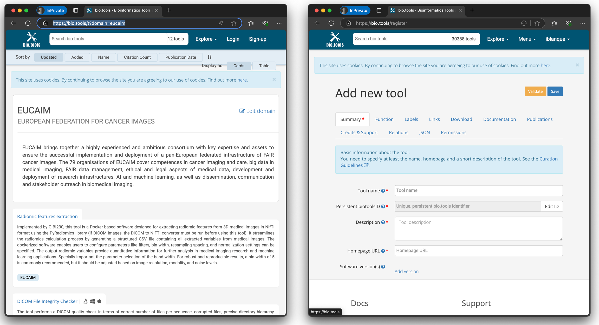

# 5\. User guide for Software providers
## 5.1. Enrolment
This guide is designed to help Software providers navigate the platform and understand the procedures in place. If you keep browsing the dashboard, you will find different ‘Become a’ sections corresponding to the four main roles that can be part of EUCAIM.


Figure 5-1. EUCAIM Dashboard, user roles information.
By choosing the Become a Software Provider icon, you will obtain detailed information about EUCAIM software specifications and the rules of participation.

Finally, at the end of the page, you will have the opportunity to start the process of becoming a Software provider by fulfilling the Expression of Interest for new Stakeholders.


Figure 5-2. EUCAIM Dashboard, how to become a Software Provider.


Figure 5-3. EUCAIM Dashboard, Expression of Interest.

Once you have expressed the interest to become a software provider, you will be invited to submit an application that will be reviewed by the access committee. Additional information about the requirements of applications running in the EUCAIM platform can be found in https://github.com/chaimeleon-eu/workstation-images. The Technical Team will contact you, by means of the Helpdesk, to assist you in the preparation and validation of your tools.

# 5.2. Software Integration
The normal procedure to integrate an application is creating a Docker image containing the main binary or script file and all the dependencies/libraries required to execute it. But there are some conditions that the image must be considered concerning security and data access.

These instructions do not apply to applications that are expected to be downloaded by the data holders to prepare the data, and refer only to those applications to run inside the EUCAIM platform.

There are two types of image depending on how the user interact with your application:

- No interactive, no UI.
If your application is launched in batch from the command line, without any interaction required by the user, then it is the easy case, there is *no need to create a helm chart* for adding to the platform's apps catalog. Once the image is built and uploaded to the repository of batch images it will be listed and *usable as a batch application*.
- Interactive, GUI or Web UI.
If your app has a user interface intended for the user to interact with, then you need to install a desktop environment, details in the next chapter.
If your app has a web user interface, then you need to install a desktop environment and also a web browser to let the user access to your web service running in the same machine (`http://localhost`, the remote localhost)1.
In order to use interactive images, *a helm chart must be created* (see the [helm chart guide](https://github.com/EUCAIM/upv-node-workstation-images/blob/main/helm-charts/README.md)). And once uploaded to the charts repository, a new application will appear in the platform's apps catalog and the user will be able to deploy a remote desktop with that image.

## 5.3. How to design a workstation image for the platform
This section explains *how to adjust your Docker image to be included in the repository of EUCAIM* so all the users can see it and run it. This is a guide to create a container image so it complies with the security restrictions of the platform. You can take them as examples some of the examples available:

- without desktop (i.e. non-interactive, batch applications): ubuntu-python, ubuntu-python-tensorflow or ubuntu-python-pytorch
- with desktop and browser (i.e. interactive applications, GUI or WebUI): ubuntu-python-xxxxx-desktop or ubuntu-python-xxxxx-desktop-jupyter

If your application requires python and some of the tools included in one of these images, you can take it as the base for your Dockerfile, putting it in the FROM instruction.

### Template
This is a template for the Dockerfile (some details are explained in the next chapters):

```
## Base image:
FROM ...

LABEL name="..."
LABEL version="0.1"
LABEL authorization="..."

############## Things done by the root user ##############
USER root
# Installation of tools and requirements:
RUN apt-get install ...
RUN pip install ...
...

# create the user (and group) "ds"
RUN groupadd -g 1000 ds && \
    useradd --create-home --shell /bin/bash --uid 1000 --gid 1000 ds
# Default password "password" for ds user. 
RUN echo "ds:password" | chpasswd

############### Now change to normal user ################
USER ds:ds

# create the directories where some volumes will be mounted (UPV reference node)
RUN mkdir -p /home/ds/datasets && \
    mkdir -p /home/ds/persistent-home && \
    mkdir -p /home/ds/persistent-shared-folder
    
# Copy of the application files into the container:
ADD ...

WORKDIR /home/ds
ENTRYPOINT ["python", "/home/ds/main.py"]
```
### Labels
If your repository on Github is of type "Private" or it has not a license that allows redistribution (MIT, GPL, Apache...), then we need that you include an authorization as a LABEL in Dockerfile like this:

```
LABEL authorization="This Dockerfile is intended to build a container image that will be publicly accessible in the platform images repository."
```

Also you should specify the *name* and *version* of the image that will appear in the repository.
For example:

```
LABEL name="my-cool-tool"
LABEL version="0.1"
```

Remember to increment the version if you make any change on the image because the kubernetes default policy to retrieve images is only pull if the tag (version) required is not present in the node where the job will run.
The tag latest will also be created pointing to the last version built.

### Important node for the tools running in the reference node: there is no Internet access in run time
Things like "apt get", "git clone", or any download from a server out of the platform must be in the Dockerfile (image build time) not in init scripts (run time). Internet access is usually needed to install requirements and tools during the image building. Once the image is built and moved to the platform repository, it will be used to create containers running within the platform, with no Internet access, and so,

- any initial script that tries to download anything from outside will fail,
- and any script or application executed by the user which tries to download anything from outside (Internet) will fail.

Aside from this, you can see there is a browser in some of our images. Indeed it is needed to access web applications and services running inside the cluster or even locally in the container itself, but it will fail to load any external web page.

### The "ds" user
The main process of the container will be run by the user with uid 1000 and gid 1000. So you should create it in the OS and use it to create any directory structure (like the directories for later mounting of volumes) or copy your application files into the container.
The name is not important, but we recommend use "ds" (contraction of data scientist) to have an homogeneous environment whatever the application or workstation that the user select.

The "root" user is only used in image build time, after the USER ds:ds instruction all the processes will run with the normal user, including any init script, the shell accessed by SSH, the desktop accessed by Guacamole or any web service (Jupyter Notebook, RStudio) for providing a web interface for the user.
The normal user should not be included into sudoers, the image repository admin will control that (only in special cases the user can be added in sudoers for a concrete and safe command, never for any command).

More details and reasons for that in helm chart guide.

(Optional) Setting the password for "ds" user

The line with chpasswd for setting the password is only needed if it is required that the user can log into the OS (through SSH for example). You should include that if you want to install sshd and let the user login with this account. Also you should change it later in an init script by one randomly generated or one set by the user in an environment variable. In both cases the final password is only known at run time and this is why it must be changed in an init script, for example with:

```
USER=ds
PREVIOUS_PASSWORD=password
PASSWORD=$(< /dev/urandom tr -dc _A-Z-a-z-0-9 | head -c${1:-16};echo;)
echo -e "$PREVIOUS_PASSWORD\n$PASSWORD\n$PASSWORD" | (passwd $USER)
```

For adding an init script you can do this (you should include in the ROOT part, not in the normal user part because `chmod` would fail):

```
# Add entrypoint script
# (useful if we want to do things with environment variables defined by the user)
ADD run.sh /home/ds/.init/run.sh
RUN chmod +x /home/ds/.init/run.sh
ENTRYPOINT ["/home/ds/.init/run.sh"]
```

### Directories for mounting volumes (Images to be run in the UPV Reference nodes)
Finally some directories should be created in the user home, where the volumes (datasets, persistent-home, persistent-shared-folder) will be mounted when the container is created into the platform.

```
RUN mkdir -p /home/ds/datasets && \
    mkdir -p /home/ds/persistent-home && \
    mkdir -p /home/ds/persistent-shared-folder
```

The volumes will be mounted and accessible in the same path in all Desktop containers (the environment from where the user launches jobs via jobman) and in all the launched job containers (the environment where the application runs).

Entrypoint and typical parameters for batch applications
In case of bath applications it is recommended to add an entrypoint.
Let's take the example that your application is launched locally with:
`python main.py -i <input-dataset-directory-path> -o <results-output-directory>`

In that example the entrypoint should be like this:
`ENTRYPOINT ["python", "/home/ds/main.py"]`

Take into account also:
- The dataset directories will be always mounted as read-only and usually the user will put it as the input path, so don't use it to write output or temporal files. You should use `/tmp` directory to write temporal files.
- In the dataset directory there is an index file that should be used for walking through the contents of the dataset (see the [usage guide](https://github.com/EUCAIM/upv-node-workstation-images/blob/main/usage-guide.md#explore-the-contents-of-a-dataset) to know how). Our recommendation for your algorithm is that simply accept as an input argument the path of dataset (/home/ds/datasets/<dataset-id>) and use the `index.json` file that will always be in any dataset directory, with that name. The schema is [here](https://github.com/chaimeleon-eu/dataset-service/blob/main/index.schema.json), and [HERE](https://github.com/EUCAIM/upv-node-workstation-images/blob/main/ubuntu-python/rootfs/home/ds/application-examples) you can find some simple and useful examples which read this file.

Batch applications will receive the execution parameters either as arguments or as environment variables.

(Optional) Include a desktop environment
If your aplication has a graphical UI (or web UI), then you should install:
- a light desktop environment for the user
- a VNC service for let the user access to the remote desktop thru our Guacamole service
- a SSH service for let the user upload files to the remote desktop thru our Guacamole service

You can take the dockerfile in ubuntu-python-xxxxx-desktop as an example or as the base for your dockerfile (putting it in the FROM instruction of yours). In this example "lxde" package is installed as a desktop environment (with other uselful tools), "x11vnc" package for the VNC service and "openssh-server" package for the SSH service.
It is important also to mention the installation of "supervisor" as a service to start and keep running the rest of services. It is required and common in dockerized apps with more than one service.

### Include a browser
If your application has a web interface then you can install a browser, for example with: `apt install firefox`. In our example `ubuntu-python-xxxxx-desktop-jupyter` it is included.

Also you may want to add an init script for starting the browser and go to initial web page of your application.

### Using GPU resources
If your application can employ GPU resources to accelerate the computation you may want to install the CUDA toolkit or just take as the base another image which includes the libraries (using the FROM instruction). For example you can take: "nvidia/cuda:10.2-runtime-ubuntu18.04" or "tensorflow/tensorflow:2.3.1-gpu".

Generally, the images created by UPV for the project take the ubuntu official image as the base image, and those with a tag which ends in cuda10 or cuda11 take the nvidia/cuda official image as the base image.

Recommendations for reducing the image size
Big-sized image can be problematic (space on disk) and take more time to download from the repository to create the container.
Besides, the smaller the image, the higher probability to be mantained in cache in the working node, so it don't have to be downloaded again when another user wants to use it.
You can reduce the size of your container image a lot with a few changes:

- Add the parameter `--no-cache-dir` to the installations with pip.
Example: `RUN pip install --no-cache-dir pydicom`
Example: `RUN pip install --no-cache-dir -r requirements.txt`
- Add the parameter `--no-install-recommends` to the installations with `apt-get`.
If, when you put this parameter, some new error appears running your algorithm, the cause of this can be that some required package were installed as a recommendation of another. In that case just add the required package in the list of packages to install, don't rely on your required package will be recommended by the other package.
Example: `apt-get -y install --no-install-recommends python3-pip`
- If you use poetry to install dependencies, remove pip and poetry caches after `poetry install`. It is important to do that in the same RUN command. Example:

```
RUN poetry install \
 && pip cache purge && rm -rf ~/.cache/pypoetry/*
```

## 5.4. EUCAIM Software registry
EUCAIM provides a software registry for those applications that has to be updated to work in the context of EUCAIM. The software registry is based on a Harbor registry of artifacts, and it is deployed in [https://harbor.eucaim.cancerimage.eu](https://harbor.eucaim.cancerimage.eu). The registry can store OCI-compatible software containers, helm charts and other artifacts. Non-OCI compliant artifacts can be encoded through a tool such as ORAS ([https://oras.land/](https://oras.land/)).

The EUCAIM Software Registry is restricted to users in the Harbor subgroup of the EUCAIM VO ([https://perun.aai.lifescience-ri.eu/organizations/3345/groups/43153](https://perun.aai.lifescience-ri.eu/organizations/3345/groups/43153)). Enrolment to this subgroup can be requested on the first access to the registry. A valid LS-AAI account is needed.  Next figure shows the page that will be shown at the first access time and the form to be filled in to request access to the subgroup.


Figure 5.4. Landing page when you access the harbor registry for the first time (left) and registration in the harbor subgroup (right).
Data holders can grant access to pull software artifacts once they register in the platform through the specific section in the Dashboard (see section 6). Only Software developers can push SW artifacts in the repository, which have to be validated by the technical committee. Software developers register through the form indicated at the beginning of this section.


Figure 5.5. View of the user profile option (left) and the information on the user profile (right) in the SW registry of EUCAIM.
Two subrepositories (projects in the harbor jargon) are available:
- ingestion-tools, for tools developed to prepare or upload the data by the data holders. These tools would be downloadable and could be used by the Data Holders in their own premises, once they have access granted.
- processing-tools, for tools developed to process the data. The tools in processing-tool project will be mainly used in the processing environment. Tools cannot be downloaded outside of the Processing environment boundaries.

The procedure for pulling or pushing an OCI-compliant artifact (e.g. a Docker container) is the following:
- Retrieve the user and access token through the harbor registry user profile (see figure 5.1)
- Open a terminal on a computer with Docker installed (version 25 or higher). 
- Login through `docker login harbor.eucaim.cancerimage.eu -u <<user>> -p <<token>>`, replacing <<user>> and <<token>> by the values obtained in the user's profile.
- Push an image using the standard Docker command: `docker push harbor.eucaim.cancerimage.eu/<<project>>/<<image_name>>:<<tag>>`, replacing `<<project>>` by one of the two projects available: ingestion-tools if the tool is related to data preparation and uploading or eucaim in case of a processing tool. Replace `<<image_name>>` and `<<tag>>` by the appropriate values.
- Pull an image using the Docker command: `docker pull harbor.eucaim.cancerimage.eu/<<project>>/<<image_name>>:<<tag>>`. Replace the values into curly brackets by the appropriate values.

In this case, we suggest to provide the `docker pull harbor.eucaim.cancerimage.eu/<<project>>/<<image_name>>:<<tag>>` as the download link.
- The procedure for pulling or pushing non OCI-compliant artifacts (e.g. a zip file) is the following:
- Retrieve the user and access token through the harbor registry user profile (see figure 5.1)
- Install ORAS tool ([https://oras.land/docs/installation](https://oras.land/docs/installation)).
- Login in the registry using the command oras login harbor.eucaim.cancerimage.eu, and provide a username and a token (see figure 5.1).
- Push an artifact (e.g. a zip file) with the command `oras push harbor.eucaim.cancerimage.eu/<<project>>/<<artifact-name>>:<<tag>> --artifact-type application/zip ./myfile.zip` . The artifact-type option is a descriptive string. Replace <<project>>>, <<artifact-name>> and <<tag>> as described in the previous case.
- Pull an artifact with the command: oras pull harbor.eucaim.cancerimage.eu/<<project>>/<<artifact-name>>:<<tag>>

In this case, we suggest to provide the oras pull harbor.eucaim.cancerimage.eu/<<project>>/<<artifact-name>>:<<tag>> as the download link.

## 5.5. Software Registration in the catalogue
Once you have the Dockerfile describing your image, you have to made it available (with all the files needed for building the image) to us in a public or private repository, in Github or any other source code repository provider. And finally create a request in the HelpDesk, under the category "Technical Support Team".  We will review the application and eventually come back with suggestions and changes. Once approved, you can proceed with the registration in the catalogue. 



Figure 5.6. EUCAIM domain in Biotools (left) and registration of a tool (right).
EUCAIM manages a catalogue of descriptions of the applications and a registry where the binaries of the applications can be deposited. The catalogue is available in the EUCAIM domain of the ELIXIR biotools ([https://bio.tools/t?domain=eucaim](https://bio.tools/t?domain=eucaim)). You should create an account and create a tool under this group. Once you have created an account, you can register your tool in the "Menu" / "Add a tool" option. It is important that you fill in as much information as possible. You can use the downloading URLs of the registry described in the previous section as the download URLs. The inclusion of the tool in the EUCAIM domain can be requested by inserting the value "eucaim" in the "collections" field of the "Labels" panel. The inclusion in the group has to be validated by the domain manager.
