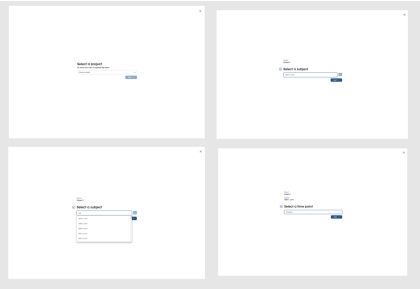
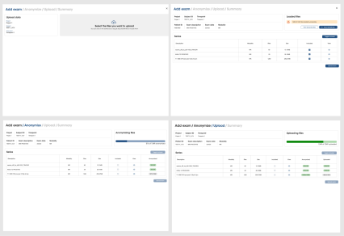
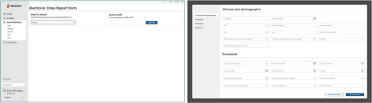
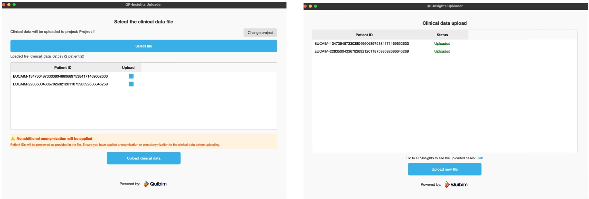

# 6\. User guide for Data Holders

This guide is designed to help users wishing to become a new member to navigate the platform and understand the procedures in place. The EUCAIM platform facilitates data sharing, reuse, and collaborative research within a governed framework to ensure transparency and compliance. If you keep browsing the dashboard, you will find different _‘Become a’_ sections corresponding to the four main roles that can be part of EUCAIM.

[Figure 51](#figur_manual_dh16). EUCAIM Dashboard, user roles information.

EUCAIM defines two ways of participating as data holders, each with unique capabilities and contributions in both research and clinical environments:

- Data holders transferring data to a Reference Repository Data Holders: If you have completed research projects and aim to maintain your datasets for long-term research availability but need support, EUCAIM offers a solution. By contributing to one of our Reference Nodes, you will ensure that data remains accessible to other researchers. The process involves signing a Data Transfer Agreement (DTA) and sharing information about your project, metadata catalogue, and software. We will guide you through data de-identification, making your contribution hassle-free.

- Federated Data Holders: If you manage active repositories and want to maintain your datasets within a federated node, EUCAIM provides the platform. As a Federated Holder, you'll collaborate with us through a Data Sharing Agreement (DSA). Share details about your research project, metadata catalogue, and software, along with information about your local computational and storage capabilities.

## 6.1. Data Preparation
EUCAIM defines three interoperability layers:

- Tier 1: Interoperability at the level of the Catalogue.
- Tier 2: Interoperability at the level of the Federated Search.
- Tier 3: Interoperability at the level of the Processing.

A detailed description of these interoperability levels is provided in section 2 of this document.

## 6.2. Contribution through Data Transfer
Data Holders can choose between transferring their data or setting up a federated node. The setup of a federated node requires the provision of storage and computing resources, as well as the setup of the federation services and the development of the adaptors.  Details on the federation services and components are given in section 2 of this document.

This section describes the case of Data Holders that opt to transfer their data to one of the reference nodes. 

### 6.2.1. Create a dataset
This User Action deals with the uploading of the data in a Reference Node and the creation of a dataset to make the dataset usable in the reference node. This User Action involves three operations:

- Uploading the DICOM images.
- Uploading the clinical associated data.
- Creating the dataset.

EUCAIM has set up two reference nodes to host data transferred from the data holders. These two reference nodes are complementary and use compatible but different technologies.

- The UPV node [https://eucaim-node.i3m.upv.es/](https://eucaim-node.i3m.upv.es/) uses an open-source platform developed in the CHAIMELEON project [https://github.com/chaimeleon-eu](https://github.com/chaimeleon-eu) for providing a fully integrated Data Lake, a Registry and a Virtual Research Environment powered by 10 dedicated physical nodes, with a total of 960 cores, 7,5TB of RAM and 25 NVIDIA GPUs with 24GB RAM each. The data ingestion component and the DICOM viewer of this node is QUIBIM QP-Insights platform, which supports the upload of DICOM studies via a DICOMWeb API (DICOMweb) and a REST API to upload the clinical data in JSON files.
- The Euro-BioImaging Medical Imaging Repository ([https://xnat.health-ri.nl](https://xnat.health-ri.nl)) is a platform operated by Health-RI ([https://www.health-ri.nl/en/services/xnat](https://www.health-ri.nl/en/services/xnat)) for storing and managing imaging provided as a service through the Euro-BioImaging ERIC. XNAT is an extensible open-source imaging platform that simplifies common tasks in imaging data management. The Imaging Data should be stored in DICOM format if that is available, but can be also stored in other formats like NIfTI, and derived data and clinical data can also be stored in appropriate file formats as described in the Data Management Plan [REF].

Details on the features supported by each Reference node are provided in Annex III.

### 6.2.2. Data Transfer to the UPV reference node
#### 6.2.2.1 Uploading DICOM images through QP-Insights:
QP-Insights allows data ingestion via a manual upload through a visual interface in which the user is able to:

Set the information related to the data such as the project in which the data has to be included and the subject (patient) and timepoint associated with the data. - Add via drag and drop the files that include the data (either DICOM or zip files). - Perform the upload of the data. The application previously triggers an anonymization process over it before any of the data leaves the user’s browser.

See live updates of the upload process progress.

This process is shown below in figure 6.2 and 6.3:

Figure 6.2. Selecting a project, a subject and a timepoint  

Figure 6.3. Adding imaging data in the browser, anonymizing

Additionally, the QP-Insights application includes a set of DICOMWeb standards-based functionalities for working with DICOM files via API. Specifically, it provides the STOW-RS API for uploading DICOM images. In this way, users can choose to upload images via the web interface or via the API, depending on their needs and permissions. An example of a STOW-RS API call is shown in the section 5.1.2 in the annexes..

#### 6.2.2.2. Uploading clinical data through QP-Insights:
QP-Insights also supports the ingestion of clinical data.

By using the user interface, an eCRF(electronic Case Report Form) template defined in an excel file can be uploaded to the platform and assigned to a single project, as shown in the figure 6.4 and 6.5 :  

Figure 6.4. Adding an eCRF template to a project in QP-Insights

Once the template is uploaded, the variables specified by the eCRF template can be filled in for each subject of the project. By clicking in the icon of the eCRF file, an editable form corresponding to the eCRF template can be edited as shown in the following pictures. The status of the eCRF (incomplete, completed or validated) is shown by different colours of the file icon.

Figure 6.5: Filling in the eCRF for a subject

In addition, QP-Insights supports the ingestion of clinical data through a set of APIs that allows verified users to interact directly with it without the need for a user interface. Uploading and editing eCRF (electronic Case Report Form) is possible via API.

This API transaction is described in the annexes (5.1.2. Calls related to UAH4).

#### 6.2.2.3. Creating the dataset:
QP-Insights also implements a dedicated workflow to create datasets from the data previously uploaded to the platform. The user will be able to select subjects or cases of a project, and create a dataset specifying the dataset name, description and purpose, along with the dataset type and method as shown in Figure 6.6. The dataset creation will later be reflected in the dataset explorer. This is performed through the call to a POST operation to the dataset service API [https://eucaim-node.i3m.upv.es/dataset-service/api/datasets](https://eucaim-node.i3m.upv.es/dataset-service/api/datasets), with all the details of the datasets.

Figure 6.6. Creation of a dataset

#### 6.2.2.4. Upload metadata
The description of this user action refers to the release of a dataset as a discoverable one. This implies two steps:

1. Register the dataset in the catalogue. This is required for all datasets, including those in Tier 1. The process of registration will be automated but it is manual for the current time being.  The dataset schema can be downloaded from this [link](https://docs.google.com/spreadsheets/d/1cj6YzIAchHnEKlH612gO91WzHfEOB4TbwBrl9a0kgE0/edit?usp=sharing). In case of doubts with the terminology, use textual descriptions. It is very important that the Identifier matches the id that the federated search will provide for this dataset, as it is the only field that cannot be changed afterwards. For example, in Figure 6.7 the id would be `c75d0998-85db-4c94-9d2c-346961f0c6f7`.  Once you have filled in all the information, create a ticket on the [https://help.cancerimage.eu/](helpdesk) under the category "catalogue", providing the spreadsheet file with the metadata information. The helpdesk team will contact you back informing if the dataset has been properly registered or requesting more information. Once it is created, you can access the registry in the catalogue at the URL: [https://catalogue.eucaim.cancerimage.eu/#/collection/<>](https://catalogue.eucaim.cancerimage.eu/#/collection/<>).

2. Make the dataset discoverable through the Federated Search (required for Tier 2 and above). If the dataset is uploaded to the reference node, it can be made discoverable by setting the status of the dataset as “published”, which triggers the publication of the metadata in Zenodo. This step is performed through the GUI in [https://eucaim-node.i3m.upv.es/dataset-service](https://eucaim-node.i3m.upv.es/dataset-service), selecting the dataset created. Figure 6.7 shows this GUI. Once the information is properly filled-in, the dataset can be set as released using the "Actions" button. 

Figure 6.7. Dataset metadata update.

3. Verify that the dataset is correct. You can create a Virtual Environment following the instructions given in Section 4. Once you have explored and verified that the information is correct, you can request the publication of the dataset's metadata through the helpdesk, by creating a token with the name "Request the publication of a dataset" and indicating its identifier.  The technical committee will verify that the data is correct and will publish the dataset, assigning a DOI and an entry in the EUCAIM UPV Reference node community in Zenodo (https://zenodo.org/communities/eucaim-upv-node-datasets/records?q=&l=list&p=1&s=10&sort=newest).

#### 6.2.2.5. Trace a dataset
The operations of creation, access and batch processing to a specific dataset are registered on a Blockchain Database. These operations are supported by the tracer service in the UPV reference node. This service logs any action performed on the datasets hosted in the reference node, but it has a REST API for any other service to register additional actions.

The information on the access history is available through the UPV reference node dashboard in https://eucaim-node.i3m.upv.es/dataset-service, and can be queried to the REST API using the GET operation on the endpoint [https://eucaim-node.i3m.upv.es/tracer-service/tracer/api/v1/traces?datasetId=dataset-id](https://eucaim-node.i3m.upv.es/tracer-service/tracer/api/v1/traces?datasetId=dataset-id), provided that the user has the proper credentials.

### 6.2.3. Data Transfer to the HealthRI reference node
XXXX

## 6.3. Contribution through a Federated Node
The setup of a federated node requires the provision of storage and computing resources, as well as the setup of the federation services and the development of the adaptors.  The federated node implies the following actions, according to each interoperability layer:
- Tier 1: (Optional) Set up a local catalogue and federate it to the central catalogue.
- Tier 2: Set up a mediator component to adapt the API of the federated search explorer to the local search API, matching the format defined in the hyperontology for the searching terms.
- Tier 3: Set up a processing environment and a materialisator for the federated processing.

## 6.3.1. Tier 1 compliance
The compliance at the Tier 1 level implies that the metadata of the datasets follow the  EUCAIM DCAT-AP specification. In this case, the data holder can decide to register the datasets directly on the EUCAIM public catalogue or to set up its own federated registry. At this moment in time, we recommend the former, as the harvester will be released soon. 
The registration of the dataset on the public catalogue. has been described in section 6.2.2.4. The set up of a local catalogue is optional and comprise the following actions:
- Dataset metadata preparation. This implies identifying the data to be shared and packaged into a dataset, the extraction of the metadata and the appropriate coding into the EUCAIM DCAT-AP terminology and vocabularies. This has been covered in section 6.2.2.3 of this document.
- Setup of a local instance of the catalogue. We recommend using Molgenis and the Catalogue application developed by ErasmusMC. Deployment can be done through a Docker container or a Kubernetes manifest. The catalogue implies a molgenis instance, a postgress database and a catalogue application. The catalogue code is available in [GitLab](https://gitlab.com/radiology/infrastructure/studies/eucaim/molgenis-emx2-eucaim), including the [Dockerfile](https://gitlab.com/radiology/infrastructure/studies/eucaim/molgenis-emx2-eucaim/-/blob/feature/rewrite_build/Dockerfile?ref_type=heads) of the catalogue container and the [Docker Compose](https://gitlab.com/radiology/infrastructure/studies/eucaim/molgenis-emx2-eucaim/-/raw/master/docker-compose.yml?ref_type=heads) file.
- Population of the data following the IM interoperability schema. This [sample file](https://docs.google.com/spreadsheets/d/19DDoFq-_Bj7wfEf5KjkISe13kS-W5EYQ/edit?usp=sharing&ouid=102741390744373897413&rtpof=true&sd=true) can be used to fill-in the information of the datasets and to create the schemas on the database.
- In the coming future, we will support the federation of datasets through a pull model in which datasets’ metadata is harvested by the central catalogue. This will require deploying a local registry and populating it with the information of the DH’s datasets.

## 6.3.2. Tier 2 compliance

The Tier 2 compliance implies that the data that is hosted at the federated node can be searched according to the searching variables defined in the CDM. At this point it is assumed that:
- The Data Holder has set up a repository with the imaging and clinical data.
- The repository has a searching endpoint that can be accessed to retrieve the number of subjects and studies that fulfil a specific filtering criteria.

## 6.3.3. Tier 3 compliance

The following is the usual “step-by-step” procedure to deploy FEM-client, the component responsible for connecting a node to the EUCAIM’s federated network. 

#### Clarifying Key Points
1. Instructions assume that the software will be installed in a single host (or Virtual machine), isolated from the internal network at the site, able to run Docker containers. Other setups will require a specific adaptation.
2. The FEM-client requires only outbound connections to RabbitMQ message broker and to FEM-Orchestrator. Connections are encrypted using node-specific credentials.  
3. No inbound connections or connection to other nodes are required.
4. Data never leaves your host machine. Only results (e.g., model weights) are shared.
5. During installation, you’ll be required to define a read-only $DATA_PATH that will hold to your local datasets (formatted according to EUCAIM requirements), and a writable $SANDBOX_PATH that tools will use for temporary and final outputs. 
6. Tools will be executed as docker containers. Docker Images will be available from EUCAIM central registry, and will follow EUCAIM agreed security requirements. 

#### Procedure
1. Express Your Interest
- Start by sending an email to the FEM technical team expressing your interest in joining the federated system.
2. Initial Guidance
- A member of the UB/BSC team will respond with a link to the FEM-client repository: https://gitlab.bsc.es/fl/fem-client
- The README includes key information, especially in the "Prerequisites" and "Getting Started" sections.
3. Credentials Delivery
- Once you're ready to deploy, confirm with the team.
- Technical team will then send you a separate email containing your FEM-client credentials.
4. Final Setup & Testing
- After setup, we’ll run some tests to verify: 1) Network connectivity; 2) FEM-client’s ability to access local infrastructure and trigger container executions; and 3) materialization of data for EUCAIM.
