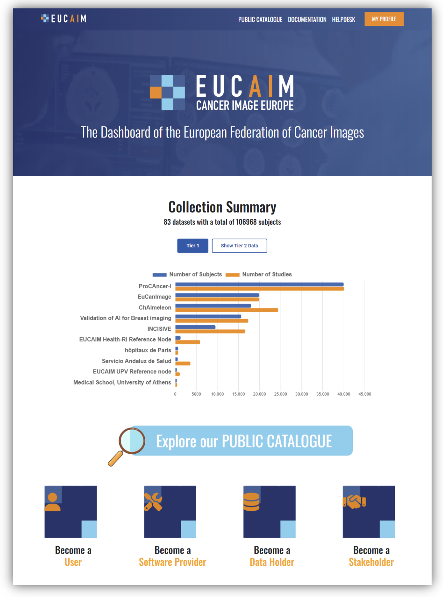
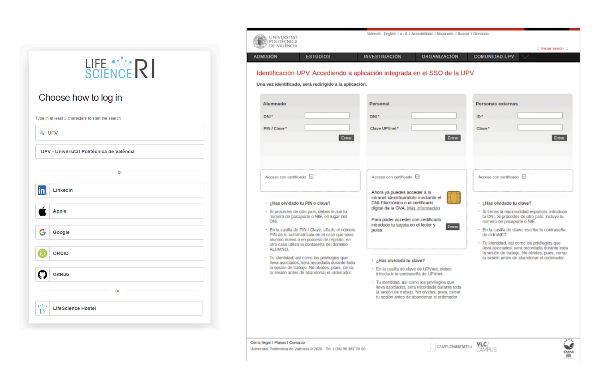
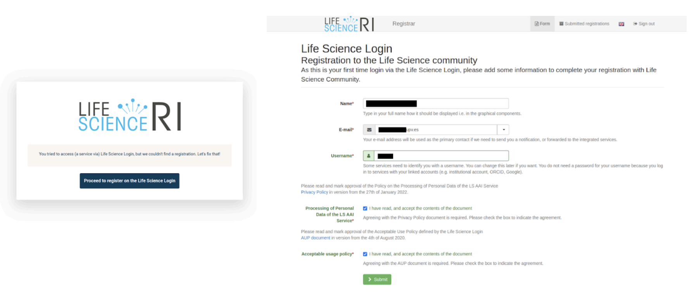
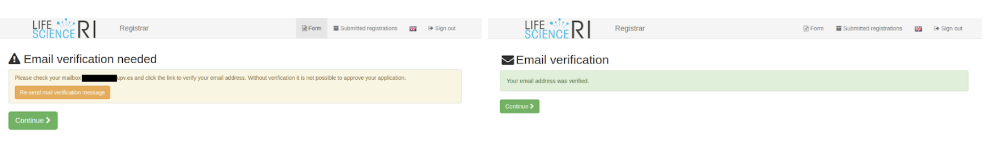
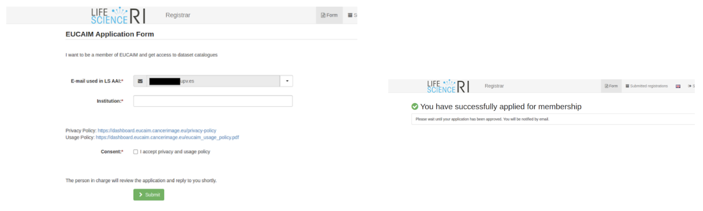
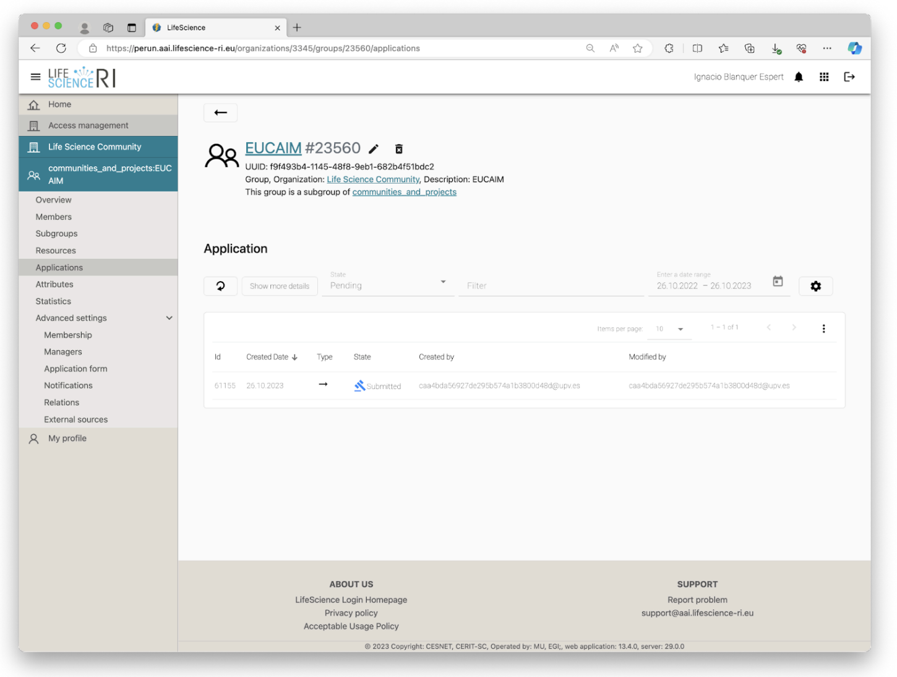
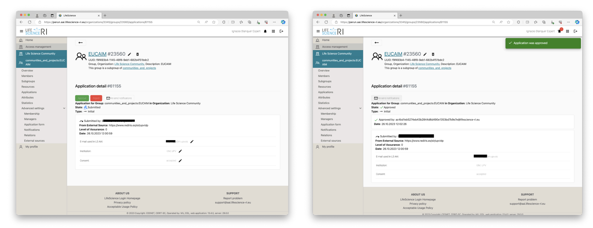
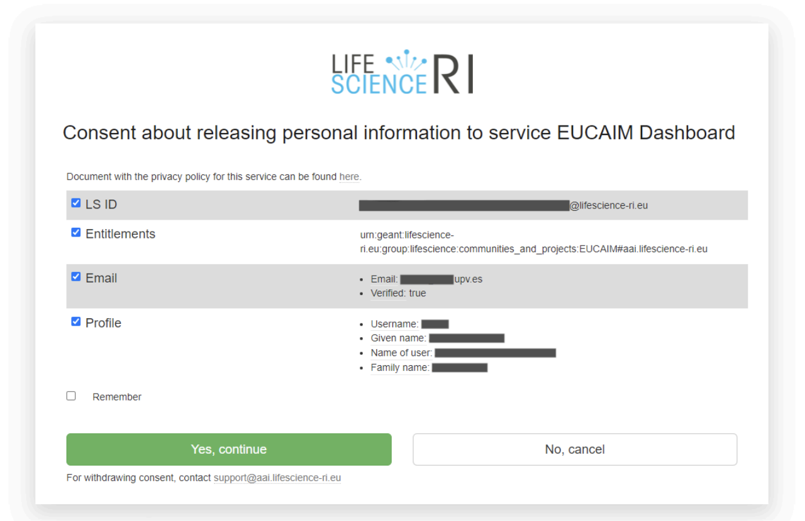
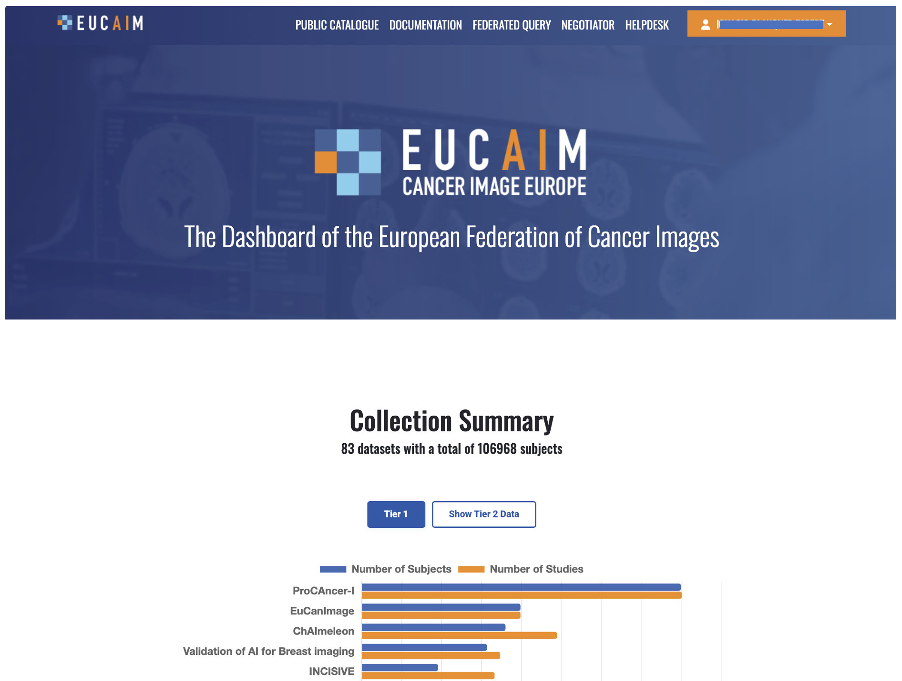

# Annex I: Registration of Users in EUCAIM
This annex shows briefly how to create an account in the AAI system in EUCAIM through the EUCAIM Dashboard. It describes the process of creating a Life Science AAI account and the request for membership in the EUCAIM Group. The annex has been extracted from the document Registration of Users in EUCAIM v0.2 11/06/2024, available in https://drive.google.com/file/d/1EsFYxbzqpyYKggyeKrKKw3FkVecDby8P/view .

## 7.1. Introduction
EUCAIM services have public (anonymous) and restricted (requiring authorisation) services. Public services can be accessed without an account. Access to restricted services requires valid and duly authorised credentials.

The Authentication and Authorisation Infrastructure (AAI) used in EUCAIM uses the Life Sciences AAI (LS-AAI) developed in the frame of the EOSC Life project. The LS-AAI is described in detail in https://lifescience-ri.eu/ls-login/ and uses institutional Identity Providers from the EduGAIN (https://technical.edugain.org/status) federation to authenticate the users.

The authentication consists of the process of verifying that a user is who declares to be. The authorisation is the process of granting the authenticated user the access to a resource according to a policy. Users in EUCAIM will need a valid LS-AAI account and the membership in the EUCAIM Group to get access to the restricted area of the services.

## 7.2. The Procedure
A user in EUCAIM will need to create a LS-AAI account and to request membership to the EUCAIM group. This process is performed only once and can be initiated through the EUCAIM Platform Dashboard (https://dashboard.eucaim.cancerimage.eu). The steps are described in the following subsections.

### 7.2.1. Creation of a LS-AAI account
LS-AAI accounts can be associated with the user institutional IdP. This is the preferred approach, as the user will not need to create a new user and password and it relates a user to an institution. However, some institutions are not included in the LS-AAI set of trusted Identity Providers, which will require creating a user and a password or to use a personal account, which will require additional verifications when the data access request is performed. The steps are the following:

Access the “My Profile” area of the Dashboard (figure A-1).

Search for the institutional IdP and log in using the institutional credentials (figure A-2). Alternatively, a user account can be created or other personal accounts can be used.

Proceed to the registration of the user in the LS Login (figure A-3). Provide with your name, email, and a username, read the Privacy Policy[5] and the Acceptable User Policy[6] of the LS-AAI service and click on the boxes confirming so.

The account’s email needs to be verified (figure A-4). Once the email has been verified, the user holds a valid LS-AAI account.

The details of the account can be modified in https://profile.aai.lifescience-ri.eu/profile.

### 7.2.2. Membership to the EUCAIM Group
The creation of a LS-AAI account is a prerequisite to access EUCAIM restricted resources, but it does not grant access to them. In order to access the EUCAIM restricted resources, the user has to request membership to the EUCAIM Group. This process is manually verified by the security team of the platform, checking that the account requests are not fake and requesting any additional information if needed. Requests will be registered in the LS-AAI platform.

It is important to outline that users in the EUCAIM Group will only have access to the aggregated data. They will not be able to access actual data. This process will be granted through the negotiator service.

The request of membership goes through the following steps:

Access the “My profile” area of the Dashboard. It will require the authentication through the LS-AAI, and it will present the enrollment form (figure A-5). The enrollment form[7] is prefilled with the user’s email and requests the user to provide the institution. Additionally, the user has to read and accept the privacy policy[8] and the user’s acceptable policy[9] for the platform.

A membership to the EUCAIM group will have been created (figure A-6). This should be manually verified and accepted or rejected (figure 7) by the administrator of the EUCAIM group (NOTE: these screenshots are not available for the user, just for the group administrator).

Once this request has been approved, the user will be able to access the restricted area through the “My profile” button of the Dashboard. When the user accesses, the system requests to confirm the acceptance of the privacy policy (figure A-8). This can be done for a single access or for six months.

Then, access to the restricted services will be granted (figure A-9).

5. <https://lifescience-ri.eu/ls-login/policy-on-the-processing-of-personal-data-of-the-ls-aai-service.html> [↑](#footnote-ref-5)

6. <https://lifescience-ri.eu/ls-login/ls-aai-aup.html> [↑](#footnote-ref-6)

7. <https://signup.aai.lifescience-ri.eu/fed/registrar/?vo=lifescience&group=communities_and_projects:EUCAIM> [↑](#footnote-ref-7)

8. <https://dashboard.eucaim.cancerimage.eu/privacy-policy> [↑](#footnote-ref-8)

9. <https://dashboard.eucaim.cancerimage.eu/eucaim_usage_policy.pdf> [↑](#footnote-ref-9)
