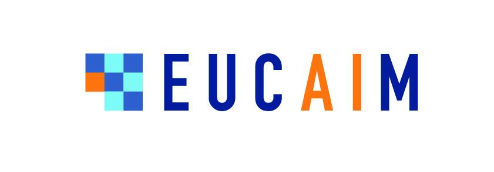

**Disclaimer**

The opinions stated in this report reflect the opinions of the authors and not the opinion of the European Commission.

All intellectual property rights are owned by the consortium of EUCAIM under terms stated in their Consortium Agreement and are protected by the applicable laws. Reproduction is not authorised without prior written agreement. The commercial use of any information contained in this document may require a licence from the owner of the information.

Cancer Image Europe is a research infrastructure established by the EUCAIM project, a flagship action of the European Cancer Imaging Initiative. This project is co-funded by the European Union under Grant Agreement 101100633.

# 1\. Introduction

EUCAIM is a federated digital infrastructure for the management of medical images in the scope of oncology. EUCAIM aims at addressing the challenges of the European Cancer Imaging Initiative. There are imaging datasets for different types of cancer, but they are widely distributed and they are not easily accessible. EUCAIM aims at addressing the following challenges:

- Foster the use of digital technologies for developing better diagnosis, treatment and prediction in cancer.
- Integrate resources, data and tools in an open infrastructure of cancer imaging for the development and validation of new tools and strategies.
- Guarantee privacy, security and trustworthiness in the access and usage of medical images.
- Contribute to the implementation of the European Health Data Space (EHDS) and the European Open Science Cloud (EOSC).

The benefits of EUCAIM are expected at four levels:

- Researchers will be able to access a digital infrastructure to access, share and process cancer medical imaging and associated data in a pan-European scope.
- Innovators will be provided with a reference framework with standardised data and state-of-the-art tools to facilitate the benchmarking and certification of new products.
- Physicians will be able to experiment and clinically validate new tools for diagnosis, prognosis and treatment of cancer.
- Citizens’ quality of life will be improved by means of early diagnosis, more accurate and personalised treatments.

The platform provides a set of components that facilitate preserving, sharing, accessing and processing medical images, especially in the context of AI development. EUCAIM offers a flexible model for supporting data holders with different levels of maturity, as well as reference storages for those data holders who cannot set up a dedicated federated node, but are able to transfer the data to a reference storage.

This document constitutes the first end-user guide to the platform, especially dedicated to the data users, researchers or innovators who would be interested in accessing the platform to browse and search for data, request access to it and process it.

**Abbreviations**

| **Terms** | **Definitions** |
| --- | --- |
| AAI | Authentication and Authorisation Infrastructure |
| AI4HI | AI4HI AI for Health Imaging Network |
| API | Application Programming Interface |
| Auth | Authentication |
| BBMRI-ERIC | European Infrastructure for Biobanking - European Research Infrastructure Consortium |
| DCAT-AP | Data Catalogue vocabulary Application Profile |
| DICOM | Digital Imaging and Communication In Medicine |
| DNS | Domain Name System |
| EduGain | Global interfederation service that interconnects multiple identity federations |
| EGI | European Grid Infrastructure |
| ELK | Elasticsearch, Logstash, Kibana |
| EOSC | European Open Science Cloud |
| EU  | European Union |
| EUCAIM | European Federation for Cancer Images |
| FAIR | Findable, Accessible, Interoperable, Reusable |
| FDP | FAIR Data Point |
| GDPR | GDPR General Data Protection Regulation |
| GPU | Graphics Processing Unit |
| Guacamole | A clientless remote desktop gateway |
| GUI | Graphical User Interface |
| IdP | Identity Provider |
| LS-AAI | Life Sciences Authentication and Authorisation Infrastructure |
| MOLGENIS | A modular web application for scientific data, initially focused on molecular genetics research (molecular genetics information system) but expanded to other disciplines. |
| Negotiator | BBMRI-ERIC service for structured negotiator for biomedical resources |
| PV  | Persistent Volume object |
| PVC | Persistent Volume Claim |
| QUIBIM | Spanish company on AI applied to Image Biomarkers |
| RIS | Radiological Information System |
| UPV | Universitat Politècnica de València (Valencia University of Technology) |
| VAULT | Hasihcorp identity-based secrets and encryption management system |
| VO  | Virtual Organisation |
| WP  | Work Package |

**References**

1. <https://lifescience-ri.eu/ls-login/> [↑](#footnote-ref-1)

2. <https://aarc-20240213064542.local/wp-content/uploads/2019/05/AARC2-DJRA1.4_v2-FINAL.pdf> [↑](#footnote-ref-2)

3. <https://github.com/chaimeleon-eu/jobman> [↑](#footnote-ref-3)

4. <https://ohif.org/> [↑](#footnote-ref-4)

5. <https://lifescience-ri.eu/ls-login/policy-on-the-processing-of-personal-data-of-the-ls-aai-service.html> [↑](#footnote-ref-5)

6. <https://lifescience-ri.eu/ls-login/ls-aai-aup.html> [↑](#footnote-ref-6)

7. <https://signup.aai.lifescience-ri.eu/fed/registrar/?vo=lifescience&group=communities_and_projects:EUCAIM> [↑](#footnote-ref-7)

8. <https://dashboard.eucaim.cancerimage.eu/privacy-policy> [↑](#footnote-ref-8)

9. <https://dashboard.eucaim.cancerimage.eu/eucaim_usage_policy.pdf> [↑](#footnote-ref-9)
